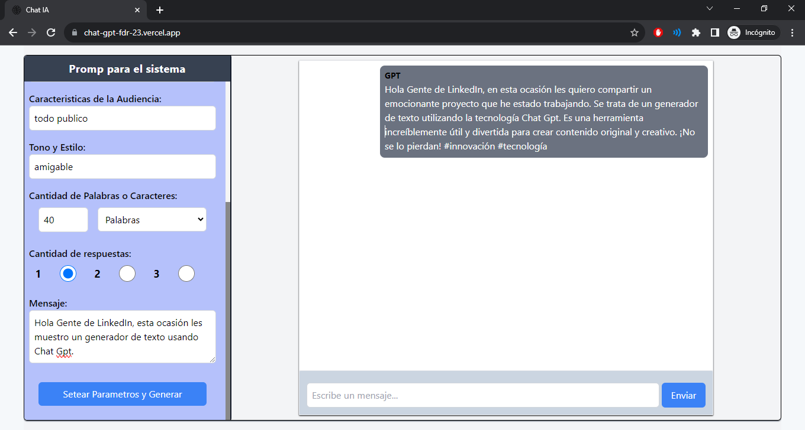

   

# Chat-IA

Proyecto en el cual estamos consumiendo la Api Chat Gpt de Open IA. 
Podemos setear varios parámetros para mejorar el mensaje que queremos mejorar como son:

*  **Nombre**:  *role que queremos que tome para generar el mensaje.*
*  **Tipo de la Comunicación:** *propósito del mensaje.*
*  **Canal:** *vía por la que queremos comunicar.*
*  **Nombre del Cuenta:** *podemos agregar una cuenta si es de el Canal por el que queremos comunicar es 
 Instagram', 'Twitter', 'Facebook'.*
* **Características de la Audiencia:** *podemos especificar el tipo de audiencia que esta dirigido nuestra comunicación.* 
* **Tono y Estilo:** *forma con la que queremos generar el mensaje, Ej. amigable, formal informal.etc.*
* **Cantidad de Palabras o Caracteres:** *setear cantidad de palabras o caracteres que queremos que tenga nueva comunicación con un máximo de 150 ya sea palabras o caracteres.*

## Como ejecutar la aplicación:

#### 1 - Clonar el repositorio

    git clone https://github.com/FdR-23/Chat-Gpt.git

#### 2 - Instalar dependencias

    $ cd Chat-Gpt
      npm install

#### 3 - Iniciar  

      npm run dev

### Deploy
https://chat-gpt-fdr-23.vercel.app/

### Dependencias Utilizadas: 

* **React**
* **JavaScript**
* **Tailwind CSS**

## Author
 **Federico Rampi** 
*  <a href="https://portfolio-fdr.vercel.app/" target=”_blank”>Portfolio </a>
*  <a href="https://www.linkedin.com/in/federico-rampi/" target=”_blank”>LinkedIn </a>